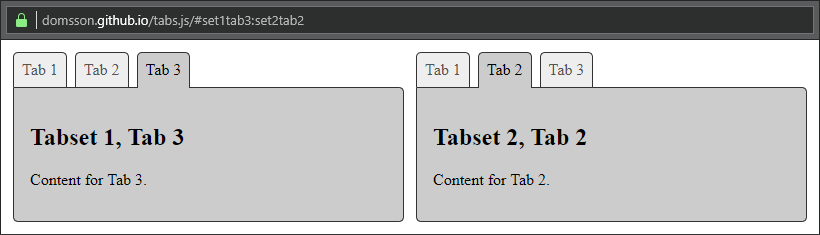

# tabs.js

Turn a regular set of anchor links and the associated content elements 
into tabs.

No actual visual changes will be performed, `tabs.js` just adds/removes 
CSS classes to the buttons and content elements. Making your tabs look 
like tabs is up to you. But don't worry, it's easy. Check the included 
CSS file.

## Features

- No dependencies, all vanilla JavaScript
- Supports mutliple tabsets per page
- Supports nested tabsets
- Sets the URL fragments based on the active tabs (optional)
- Your page will still work fine for users without JavaScript
- Very minimal markup requirements (literally just one attribute)
- Does not set, impose or require any CSS rules
- Performs only very little markup changes
- Easy to use, flexible in how to use
- Can be configured to some degree
- Extensively commented source code
- Minified version is ~3 KB (and only ~1 KB gzipped)
- Does not support Internet Explorer

## Markup requirements

1. Set the `data-tabs` attribute on your tab button container
2. Either have the buttons be direct children of the container, or hand 
   in the `btn_select` option with a custom CSS selector for the buttons
3. Every button needs to be (or contain) an anchor element with a `href`
   that targets another element's `id` (the other element being the tab 
   container element)
  
### Markup example

This is an example for markup that `tabs.js` can work with:

	<ul data-tabs>
		<li><a href="#chapter1">Chapter 1</a></li>
		<li><a href="#chapter2">Chapter 2</a></li>
		<li><a href="#chapter3">Chapter 3</a></li>
	</ul>
	<section id="chapter1"><!-- ... --></section>
	<section id="chapter2"><!-- ... --></section>
	<section id="chapter3"><!-- ... --></section>

Once `tabs.js` has processed the above, it will look like this:

	<ul data-tabs data-tabs-set="">
		<li><a href="#chapter1">Chapter 1</a></li>
		<li><a href="#chapter2">Chapter 2</a></li>
		<li><a href="#chapter3">Chapter 3</a></li>
	</ul>
	<section id="chapter1" class="tab active"><!-- ... --></section>
	<section id="chapter2" class="tab hidden"><!-- ... --></section>
	<section id="chapter3" class="tab hidden"><!-- ... --></section>

## Usage

**Note**: Please remember to minify `tabs.js` in production as there are 
many KB of comments in there.

Create a `Tabs` instance once the DOM has loaded. For example:

	function setupTabs() {
		(new Tabs()).init();
	}
	window.onload = setupTabs;
	
Once `tabs.js` has processed a tab set, it will set the `data-tabs-set` 
attribute on the element that has the `data-tabs` attribute set. If you pass 
in a custom attribute, that will be used instead of `data-tabs`.
 
If you have multiple tabsets on your page, create one `Tabs` instance 
for each of them. This can be done in a loop, for example like this:

	function setupTabs() {
		let attr = "data-tabs";
		let sets = document.querySelectorAll(`[${attr}]`);
		let opts = {};
		for (let set of sets) {
			opts.name = set.getAttribute(attr);
			opts.attr = attr;
			(new Tabs(opts)).init();
		}
	}
	window.onload = setupTabs;
 
## Options

You can pass an object with some configuration options when you create 
a new `Tabs` instance. Possible properties are as follows:

| Name         | Default     | Description |
|--------------|-------------|-------------|
| `attr`       | `"data-tabs"`  | Attribute of the tab navigation element |
| `name`       | `null`         | Attribute value of the tab navigation element, this is useful if you need to init different tab sets with differen options |
| `nav_class`  | `"tab-nav"`    | CSS class to set on the tab navigation (element that carries the `attr`) |
| `btn_select` | `null`         | CSS selector for tab buttons; you only need this if your button elements are not direct children of the tab navigation element (or if there are other child elements that should not be treated as tab buttons) |
| `btn_class`  | `"tab-button"` | CSS class to add to all processed tab buttons |
| `btn_active` | `"active"`     | The CSS class to set for active tab buttons |
| `tab_class`  | `"tab"`        | The CSS class to set for every tab content element |
| `tab_active` | `"active"`     | The CSS class to set for active tab content elements |
| `tab_hidden` | `null`         | The CSS class to set for hidden tab content elements |
| `set_frags`  | `true`         | Manipulate the URL fragments according to the active tab(s)? |
| `frag_sep`   | `":"`          | The separator used to split multiple URL fragments; this needs to be the same for all Tabs instances on a page! |

### Example

    let tabset = new Tabs({ "attr": "data-foobar" });
    tabset.init();
    
## API

| Function   | Description |
|------------|-------------|
| `init()`   | Initialize the tabset, this adds event listeners to the tab buttons |
| `open(id)` | Open the tab specified by the given id |
| `kill()`   | Remove the event listeners set by `init()` |

When you call `kill()` on an instance, it will remember the options you 
have set, as well as the navigation element (tabset) it was originally 
attached to. This way, you can call `init()` again to re-initialize this 
tabset at any point in time. If you ever need to dynamically add or 
remove a tab from a tabset, you could call `kill()` and `init()` to make 
sure the new or removed tabs are recognized correctly.
	
## Things to (maybe) change in the future

- Maybe make it so that the browser back button works after a change
  of the fragmen part of the URL - not sure about this one yet
